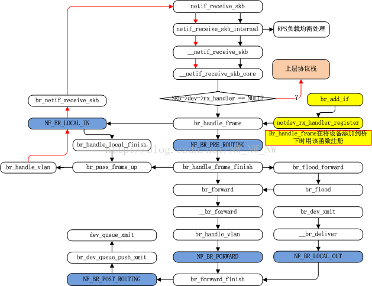

# bridge接收转发流程

基于Linux 4.14.5



注意：网桥从设备才注册了rx_handler函数，网桥本身是没有注册的

#### 一.内核向bridge发送过程

```
文件位于：net/bridge/br_private.h
br_dev_xmit
	---> br_forward
		---> __br_forward
			---> NF_HOOK(..., br_forward_finish)
				---> NF_HOOK(..., br_dev_queue_push_xmit)
					---> dev_queue_xmit
						---> __dev_queue_xmit
							---> if (q->enqueue)
```

#### 二.从设备接收过程

 

```
文件位于：net/core/dev.c
netif_receive_skb
	---> netif_receive_skb_internal
		---> __netif_receive_skb
			---> __netif_receive_skb_core

__netif_receive_skb_core
	---> rx_handler = rcu_dereference(skb->dev->rx_handler) //从设备才有rx_handler
		---> br_handle_frame
			---> br_handle_frame_finish
				---> br_forward //转发
				---> br_flood_forward //洪泛
				---> br_pass_frame_up //向上传入协议栈

br_forward
	---> __br_forward
		---> br_forward_finish
			---> br_dev_queue_push_xmit //文件net\bridge\br_forward.c，在这里打印skb->dev
				---> dev_queue_xmit(skb) 
```

#### 参考链接

- 1.[网桥原理](https://blog.csdn.net/bailyzheng/article/details/29244963)
- 2.[Linux-虚拟网络设备-LinuxBridge](https://blog.csdn.net/sld880311/article/details/77840343)：docker网桥的转发路径
- 3.[Linux下的虚拟Bridge实现](https://blog.csdn.net/jianchaolv/article/details/25777249)
- 4.[skb桥转发蓝图（五）](https://blog.csdn.net/NW_NW_NW/article/details/76153027)